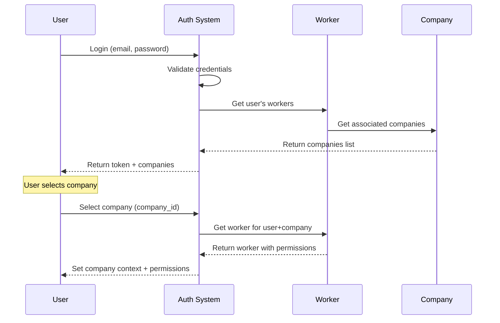

# Diagrama de Workers - Sistema Faltante

## 🔧 Implementación Propuesta para Workers

### Diagrama Específico del Sistema de Workers

```mermaid
classDiagram
    class User {
        +id: int
        +name: string
        +email: string
        +password: string
        +created_at: datetime
        +updated_at: datetime
        --
        +workers(): HasMany~Worker~
        +companies(): BelongsToMany~Company~
        +getCurrentCompany(): Company
        +hasAccessToCompany(companyId): boolean
    }

    class Company {
        +id: int
        +name: string
        +business_name: string
        +rfc: string
        +address: string
        +phone: string
        +email: string
        +is_active: boolean
        +created_at: datetime
        +updated_at: datetime
        --
        +workers(): HasMany~Worker~
        +users(): BelongsToMany~User~
        +getActiveWorkers(): Collection~Worker~
        +getWorkerByUser(userId): Worker
    }

    class Worker {
        +id: int
        +company_id: int
        +user_id: int
        +employee_number: string
        +position: string
        +department: string
        +hire_date: date
        +salary: decimal
        +is_active: boolean
        +permissions: json
        +created_at: datetime
        +updated_at: datetime
        --
        +company(): BelongsTo~Company~
        +user(): BelongsTo~User~
        +movements(): HasMany~Movement~
        +purchaseOrders(): HasMany~PurchaseOrder~
        +salesOrders(): HasMany~SalesOrder~
        +inventoryCounts(): HasMany~InventoryCount~
        +canAccessLocation(locationId): boolean
        +hasPermission(permission): boolean
    }

    class WorkerPermission {
        +id: int
        +worker_id: int
        +permission_type: string
        +resource_id: int
        +resource_type: string
        +can_read: boolean
        +can_write: boolean
        +can_delete: boolean
        +created_at: datetime
        +updated_at: datetime
        --
        +worker(): BelongsTo~Worker~
    }

    class Department {
        +id: int
        +company_id: int
        +name: string
        +description: string
        +manager_id: int
        +is_active: boolean
        +created_at: datetime
        +updated_at: datetime
        --
        +company(): BelongsTo~Company~
        +manager(): BelongsTo~Worker~
        +workers(): HasMany~Worker~
    }

    %% Relaciones
    User ||--o{ Worker : user_id
    Company ||--o{ Worker : company_id
    Company ||--o{ Department : company_id
    Worker }|--|| Department : department_id
    Worker ||--o{ WorkerPermission : worker_id
    Department }|--|| Worker : manager_id
```

---

## 🚀 Comandos para Implementar

### 1. Crear las migraciones

```bash
# Crear migración para workers
php artisan make:migration create_workers_table

# Crear migración para departamentos
php artisan make:migration create_departments_table

# Crear migración para permisos específicos de workers
php artisan make:migration create_worker_permissions_table

# Agregar company_id a users (opcional)
php artisan make:migration add_company_id_to_users_table
```

### 2. Crear los modelos

```bash
php artisan make:model Admin/Worker
php artisan make:model Admin/Department
php artisan make:model Admin/WorkerPermission
```

### 3. Crear los controladores

```bash
php artisan make:controller Admin/WorkerController --resource
php artisan make:controller Admin/DepartmentController --resource
```

### 4. Crear los resources

```bash
php artisan make:resource Admin/WorkerResource
php artisan make:resource Admin/DepartmentResource
```

---

## 📋 Migraciones Propuestas

### Workers Table

```php
Schema::create('workers', function (Blueprint $table) {
    $table->id();
    $table->foreignId('company_id')->constrained()->onDelete('cascade');
    $table->foreignId('user_id')->constrained()->onDelete('cascade');
    $table->foreignId('department_id')->nullable()->constrained()->onDelete('set null');
    $table->string('employee_number', 50)->unique();
    $table->string('position', 100)->nullable();
    $table->date('hire_date')->nullable();
    $table->decimal('salary', 12, 2)->nullable();
    $table->json('permissions')->nullable(); // Permisos específicos
    $table->boolean('is_active')->default(true);
    $table->timestamps();

    $table->unique(['user_id', 'company_id']); // Un usuario por compañía
    $table->index(['company_id', 'is_active']);
    $table->index(['employee_number']);
});
```

### Departments Table

```php
Schema::create('departments', function (Blueprint $table) {
    $table->id();
    $table->foreignId('company_id')->constrained()->onDelete('cascade');
    $table->string('name', 150);
    $table->string('description')->nullable();
    $table->foreignId('manager_id')->nullable()->constrained('workers')->onDelete('set null');
    $table->boolean('is_active')->default(true);
    $table->timestamps();

    $table->index(['company_id', 'is_active']);
});
```

### Worker Permissions Table (Opcional para permisos granulares)

```php
Schema::create('worker_permissions', function (Blueprint $table) {
    $table->id();
    $table->foreignId('worker_id')->constrained()->onDelete('cascade');
    $table->string('permission_type'); // 'location', 'product', 'customer', etc.
    $table->unsignedBigInteger('resource_id')->nullable(); // ID del recurso específico
    $table->string('resource_type')->nullable(); // Tipo del recurso
    $table->boolean('can_read')->default(true);
    $table->boolean('can_write')->default(false);
    $table->boolean('can_delete')->default(false);
    $table->timestamps();

    $table->index(['worker_id', 'permission_type']);
    $table->index(['resource_type', 'resource_id']);
});
```

---

## 🎯 Casos de Uso del Sistema de Workers

### 1. **Asignación de Empleados a Compañías**

-   Un usuario puede trabajar en múltiples compañías
-   Cada worker tiene un employee_number único por compañía
-   Sistema de activation/deactivation por compañía

### 2. **Control de Acceso por Sucursal**

```php
// Verificar si un worker puede acceder a una sucursal
$worker->canAccessLocation($locationId);

// Obtener sucursales accesibles para un worker
$worker->accessibleLocations();
```

### 3. **Permisos Granulares**

```php
// Verificar permisos específicos
$worker->hasPermission('products.create');
$worker->hasPermission('inventory.view', $locationId);

// Permisos por departamento
$worker->department->permissions;
```

### 4. **Gestión de Departamentos**

-   Cada worker pertenece a un departamento
-   Los departamentos tienen managers (que son workers)
-   Permisos pueden heredarse por departamento

---

## 🔄 Flujo de Autenticación Actualizado



---

## 📱 Frontend Components Faltantes

### 1. **Workers Management**

-   Lista de empleados por compañía
-   Formulario de creación/edición de workers
-   Asignación de permisos y departamentos

### 2. **Department Management**

-   CRUD de departamentos
-   Asignación de managers
-   Gestión de permisos por departamento

### 3. **Company Context Enhancement**

-   Selector mejorado con información de worker
-   Display de permisos del usuario actual
-   Restricciones de UI basadas en permisos

---

## ⚡ Prioridad de Implementación

### Fase 1 (Crítica)

1. ✅ Migración `workers` table
2. ✅ Modelo `Worker` con relaciones básicas
3. ✅ Actualizar modelos `User` y `Company`
4. ✅ WorkerController básico

### Fase 2 (Importante)

5. ⏳ Frontend para gestión de workers
6. ⏳ Sistema de permisos básico
7. ⏳ Actualizar autenticación con company context

### Fase 3 (Mejoras)

8. ⏳ Departamentos y jerarquías
9. ⏳ Permisos granulares
10. ⏳ Reportes y auditoría

Este sistema de workers es fundamental para el funcionamiento multi-tenant del sistema PlastiGest.
